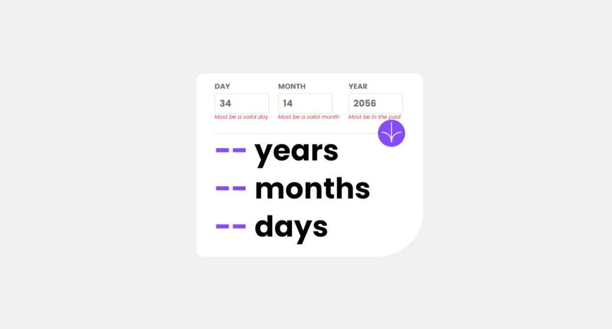
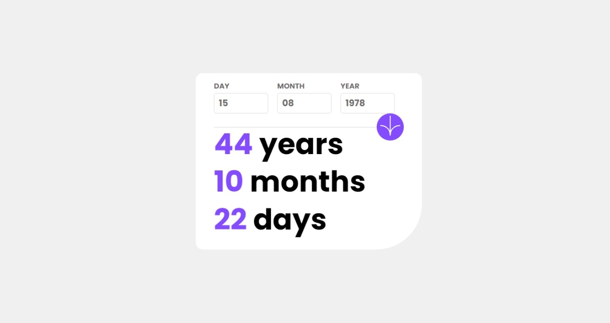

# Frontend Mentor - Age calculator app solution

This is a solution to the [Age calculator app challenge on Frontend Mentor](https://www.frontendmentor.io/challenges/age-calculator-app-dF9DFFpj-Q). Frontend Mentor challenges help you improve your coding skills by building realistic projects.

## Table of contents

- [Overview](#overview)
  - [The challenge](#the-challenge)
  - [Screenshot](#screenshot)
  - [Links](#links)
- [My process](#my-process)
  - [Built with](#built-with)
  - [What I learned](#what-i-learned)
  - [Continued development](#continued-development)
- [Author](#author)

## Overview

### The challenge

Users should be able to:

- View an age in years, months, and days after submitting a valid date through the form
- Receive validation errors if:
  - Any field is empty when the form is submitted | completed
  - The day number is not between 1-31 | completed
  - The month number is not between 1-12 | completed
  - The year is in the future | completed
  - The date is invalid e.g. 31/04/1991 (there are 30 days in April) | completed
- View the optimal layout for the interface depending on their device's screen size | completed
- See hover and focus states for all interactive elements on the page | completed
- **Bonus**: See the age numbers animate to their final number when the form is submitted | to be implemented

### Screenshot

> 
> Initial Page screenshot

> 
> Some error

> 
> Final Page

### Links

- Solution URL: [github solution](https://github.com/Seixaslima/age-calculator-app)
- Live Site URL: [Vercel](https://age-calculator-app-six-weld.vercel.app/)

## My process

### Built with

- [React](https://reactjs.org/) - JS library
- [TypeScrip](https://www.typescriptlang.org/) - Language

### What I learned

I improved my skills in React and TypeScript. I learned some ways to validate a form and improved my skills in creating an HTML layout.

To see how you can add code snippets, see below:

### Continued development

I need to improve my ability to use custom context on React and use better TypeScript language.

## Author

- Website - [Lucas Seixas](https://github.com/Seixaslima)
- Frontend Mentor - [@Seixaslima](https://www.frontendmentor.io/profile/Seixaslima)
- Instagram - [@seixaslima](https://www.instagram.com/seixaslima/)
